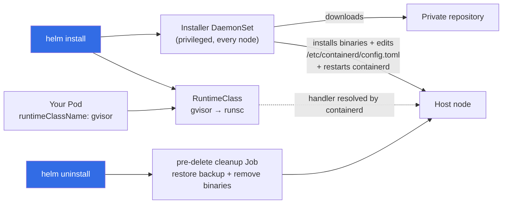
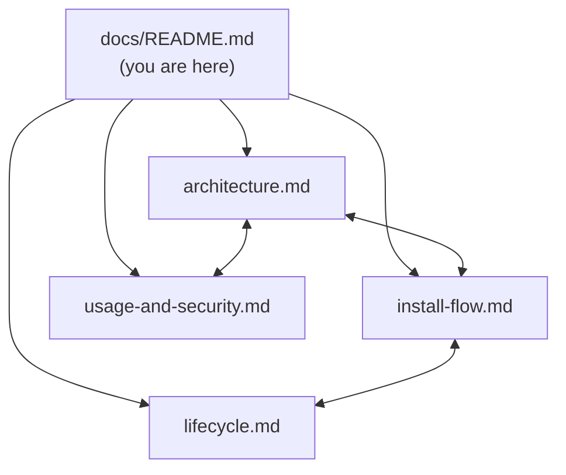

# gvisor-deploy — Technical Documentation

Visual, technical reference for the **`gvisor-deploy`** Helm chart
(`charts/gvisor-deploy/`, chart version `0.1.0`).

The chart installs [gVisor](https://gvisor.dev/) — the `runsc` runtime plus the
`containerd-shim-runsc-v1` shim — onto Kubernetes nodes and wires it into
**containerd**, so workloads can run inside the gVisor sandbox by setting
`spec.runtimeClassName: gvisor`. It is modelled on the `kata-deploy` pattern: a
privileged `DaemonSet` does the per-node install, and a `RuntimeClass` exposes the
runtime to pods. Binaries are pulled from a **configurable private repository**
(default a private raw repo) — the chart never reaches the public gVisor storage
unless you point it there.

## The 10-second mental model



## What the chart does, in four steps

1. **Deploys resources** — a privileged installer `DaemonSet`, two script
   `ConfigMap`s, a `RuntimeClass`, RBAC, and a `ServiceAccount`.
2. **Installs gVisor on every node** — the DaemonSet downloads `runsc` +
   `containerd-shim-runsc-v1`, writes them to the host, registers the `runsc`
   runtime in `/etc/containerd/config.toml`, and restarts containerd.
3. **Exposes the runtime** — the `RuntimeClass` `gvisor` (handler `runsc`) lets
   pods opt into the sandbox.
4. **Cleans up on uninstall** — a `pre-delete` hook `Job` restores the containerd
   config backup and removes the installed binaries.

## Documentation map

| Document | What it covers |
|---|---|
| [Architecture](architecture.md) | Every resource the chart renders, how they relate, namespacing, RBAC, labels. |
| [Install flow](install-flow.md) | The installer DaemonSet and `install.sh` step-by-step: download → verify → install → edit containerd → restart. |
| [Lifecycle](lifecycle.md) | Helm install / upgrade / uninstall, the `pre-delete` cleanup hook, and `cleanup.sh`. |
| [Usage & security](usage-and-security.md) | Running pods on gVisor via `RuntimeClass`, the runtime request path, and the privileged-DaemonSet security model. |



## Quick start

```sh
helm repo add gvisor-deploy https://auggie246.github.io/gvisor-helm-chart
helm repo update
helm install gvisor-deploy gvisor-deploy/gvisor-deploy \
  -n gvisor-system --create-namespace \
   --set binaries.baseUrl=https://repo.internal.example.com/repository/gvisor-raw
```

Then run a pod on gVisor:

```yaml
apiVersion: v1
kind: Pod
metadata:
  name: nginx-gvisor
spec:
  runtimeClassName: gvisor
  containers:
    - name: nginx
      image: nginx
```

> For installation options, values, and the published Helm repo, see the chart
> [README](../README.md). For the full values reference, see that README's
> *Values* section.

---

*These docs describe chart version `0.1.0`. If you change template behavior, update
the matching document and the diagrams in it.*
