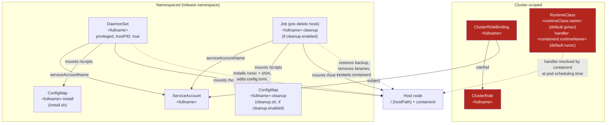

# Architecture

Every Kubernetes resource the **`gvisor-deploy`** chart (`charts/gvisor-deploy/`,
version `0.1.0`) renders, how those resources reference each other, which ones are
cluster-scoped vs namespaced, and the RBAC permissions the chart grants itself.

## What you'll find here

- A resource map: every template, what it renders, and how the pieces connect.
- A cluster-scoped vs namespaced breakdown.
- The labels/helpers every resource shares.
- The RBAC `ClusterRole` permissions in full.
- The installer image reference.

For the byte-by-byte install logic see [Install flow](install-flow.md). For
install/upgrade/uninstall behavior and the cleanup hook see
[Lifecycle](lifecycle.md). For how pods consume the `RuntimeClass` and the
security model of the privileged DaemonSet see
[Usage & security](usage-and-security.md). Back to [docs home](README.md).

## Resource graph

All resources below are rendered from a single Helm release. Names use the
`gvisor-deploy.fullname` helper (release-name based, truncated to 63 chars) unless
noted. Solid arrows are direct references (mounts, bindings, ownership); dashed
arrows are indirect/runtime relationships.



The `ClusterRole`/`ClusterRoleBinding` exist so the `ServiceAccount` used by the
DaemonSet (and cleanup Job) can read node/runtimeclass/daemonset state from the
API server — they don't gate access to the hostPath or `nsenter`/`chroot` calls,
which come from `privileged: true` + `hostPID: true` at the pod level (see
[Usage & security](usage-and-security.md)).

## Resource summary

| Template | Kind | API version | Name | Scope | Notes |
|---|---|---|---|---|---|
| `daemonset.yaml` | DaemonSet | `apps/v1` | `<fullname>` | namespaced | Node installer. `privileged: true`, `hostPID: true`. One container, `installer`. |
| `configmap-install.yaml` | ConfigMap | `v1` | `<fullname>-install` | namespaced | Holds `install.sh`. Mounted into the DaemonSet at `/scripts`. |
| `configmap-cleanup.yaml` | ConfigMap | `v1` | `<fullname>-cleanup` | namespaced | Holds `cleanup.sh`. Only if `cleanup.enabled`. Carries the `pre-delete` hook annotation. |
| `cleanup-job.yaml` | Job | `batch/v1` | `<fullname>-cleanup` | namespaced | Only if `cleanup.enabled`. `pre-delete` hook; runs `cleanup.sh`. |
| `runtimeclass.yaml` | RuntimeClass | `node.k8s.io/v1` | `<runtimeClass.name>` (default `gvisor`) | **cluster** | Only if `runtimeClass.create`. `handler: <containerd.runtimeName>` (default `runsc`). |
| `rbac.yaml` | ClusterRole + ClusterRoleBinding | `rbac.authorization.k8s.io/v1` | `<fullname>` | **cluster** | Binds the ServiceAccount; see [RBAC permissions](#rbac-permissions) below. |
| `serviceaccount.yaml` | ServiceAccount | `v1` | `<fullname>` | namespaced | Used by both the DaemonSet and the cleanup Job. |
| `NOTES.txt` | — | — | — | — | Printed after `helm install`/`upgrade`. |
| `_helpers.tpl` | — | — | — | — | Name/fullname/namespace/labels/image helpers (no rendered resource). |

**Cluster-scoped resources** (no namespace, visible cluster-wide once created):
`RuntimeClass`, `ClusterRole`, `ClusterRoleBinding`.

**Namespaced resources** (live in `gvisor-deploy.namespace`, i.e.
`.Values.namespaceOverride` or `.Release.Namespace`): `DaemonSet`, both
`ConfigMap`s, the cleanup `Job`, `ServiceAccount`.

## Shared labels and helpers

Defined once in `_helpers.tpl` and applied to every rendered resource via
`gvisor-deploy.labels`:

| Helper | Produces |
|---|---|
| `gvisor-deploy.name` | `.Values.nameOverride` or `.Chart.Name`, truncated to 63 chars. |
| `gvisor-deploy.fullname` | Release-name-based full name (handles `fullnameOverride`), truncated to 63 chars. |
| `gvisor-deploy.namespace` | `.Values.namespaceOverride` or `.Release.Namespace`. |
| `gvisor-deploy.serviceAccountName` | Same value as `gvisor-deploy.fullname`. |
| `gvisor-deploy.image` | `<image.repository>:<image.tag \| default "latest">` (default image: `debian:stable-slim`). |
| `gvisor-deploy.labels` | `helm.sh/chart`, selector labels, `app.kubernetes.io/version` (if set), `app.kubernetes.io/managed-by`, `app.kubernetes.io/part-of: gvisor-deploy`. |
| `gvisor-deploy.selectorLabels` | `app.kubernetes.io/name`, `app.kubernetes.io/instance` — used as the DaemonSet's pod selector. |

Every template above includes `gvisor-deploy.labels`; the DaemonSet additionally
uses `gvisor-deploy.selectorLabels` for `spec.selector.matchLabels` and the pod
template labels, so the selector stays stable across upgrades.

## RBAC permissions

The `ClusterRole` (`rbac.yaml`) bound to the chart's `ServiceAccount`:

| API group | Resource | Verbs | Why |
|---|---|---|---|
| `""` (core) | `nodes` | `get`, `patch` | Read/patch node objects as part of the install workflow. |
| `node.k8s.io` | `runtimeclasses` | `get`, `list` | Discover existing `RuntimeClass` objects. |
| `apps` | `daemonsets` | `get`, `list`, `watch` | Observe the installer DaemonSet's own rollout state. |

The `ClusterRoleBinding` binds this `ClusterRole` to the `ServiceAccount`
`<fullname>` in the release namespace — both the installer `DaemonSet` and the
cleanup `Job` run as this same `ServiceAccount` (`serviceAccountName` field in
both pod specs).

This API-level RBAC is intentionally narrow. It does **not** grant the host
access the DaemonSet and cleanup Job actually use to install binaries and
restart containerd — that comes from `privileged: true` and `hostPID: true` at
the pod `securityContext`/spec level, independent of the Kubernetes RBAC model.
See [Usage & security](usage-and-security.md) for that threat model.

## Installer image

Both the DaemonSet container and the cleanup Job container use the same image,
resolved by the `gvisor-deploy.image` helper:

```
<image.repository>:<image.tag | default "latest">
```

Defaults to `debian:stable-slim`. `imagePullPolicy` is `.Values.image.pullPolicy`
(default `IfNotPresent`); `imagePullSecrets` is applied if set. The image only
needs a POSIX shell plus `curl` or `wget` — see [Install flow](install-flow.md)
for what the container actually runs.

---

See [Install flow](install-flow.md) for what runs inside the DaemonSet's
`install.sh`, [Lifecycle](lifecycle.md) for how the cleanup `Job` and hooks fit
into `helm uninstall`, and [Usage & security](usage-and-security.md) for how
pods request the `gvisor` runtime and the security implications of the
privileged DaemonSet. Back to [docs home](README.md).
