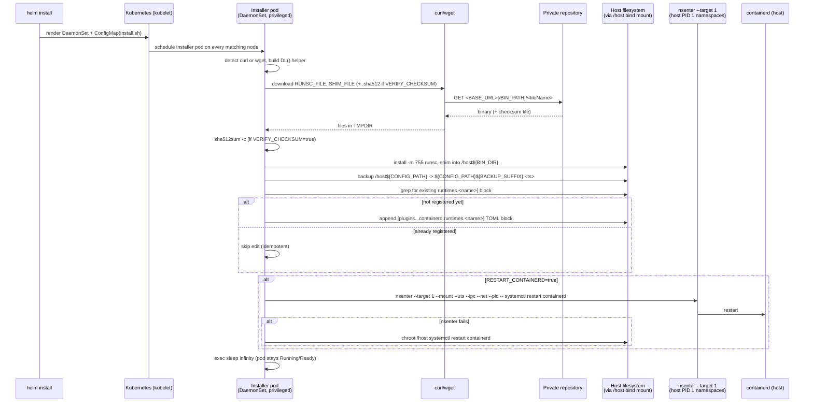

# Install flow

How the installer `DaemonSet` and its `install.sh` script get `runsc` and
`containerd-shim-runsc-v1` onto every node, register them with containerd, and
keep the node's CRI runtime working afterward.

**What you'll find here:** a sequence diagram of the full install path from
`helm install` to a restarted containerd, a flowchart of `install.sh`'s
internal decision logic, the env-var → values mapping the DaemonSet injects,
the exact containerd config block that gets appended, and an explanation of
how the installer pod is able to mutate the host at all.

## End-to-end sequence



This is the same path summarized in the [docs home](README.md) mental-model
diagram and detailed resource-by-resource in [Architecture](architecture.md);
this page is the zoom-in on step 2, "installs gVisor on every node."

## `install.sh` decision logic

```mermaid
flowchart TD
    Start(["installer container starts<br/>/bin/sh /scripts/install.sh"]) --> CACheck{"CA_CERT_FILE set?"}
    CACheck -->|yes| CARead{"CA file readable?"}
    CARead -->|no| CAFail["ERROR: CA_CERT_FILE not readable<br/>exit 1"]
    CARead -->|yes| CAOpt["CURL_CA_OPT=--cacert FILE<br/>WGET_CA_OPT=--ca-certificate=FILE"]
    CACheck -->|no| DLTool
    CAOpt --> DLTool{"curl available?"}
    DLTool -->|yes| DLCurl["DL() = curl -fsSL ${CURL_CA_OPT}<br/>+ extraDownloadArgs"]
    DLTool -->|no| WgetCheck{"wget available?"}
    WgetCheck -->|yes| DLWget["DL() = wget -q ${WGET_CA_OPT}<br/>+ extraDownloadArgs"]
    WgetCheck -->|no| Fail["ERROR: neither curl nor wget<br/>exit 1"]

    DLCurl --> Auth{"REPO_USERNAME &&<br/>REPO_PASSWORD set?"}
    DLWget --> Auth
    Auth -->|yes| AuthDL["curl -u user:pass / wget --user --password"]
    Auth -->|no| PlainDL["unauthenticated request"]

    AuthDL --> BuildURL["REPO_URL = BASE_URL[/BIN_PATH]"]
    PlainDL --> BuildURL
    BuildURL --> Fetch["download RUNSC_FILE, SHIM_FILE to TMPDIR"]

    Fetch --> Verify{"VERIFY_CHECKSUM=true?"}
    Verify -->|yes| FetchSha["download *_SHA files,<br/>sha512sum -c in TMPDIR"]
    Verify -->|no| Install
    FetchSha --> Install["install -m 755 into /host${BIN_DIR}"]

    Install --> ConfigExists{"/host${CONFIG_PATH}<br/>exists?"}
    ConfigExists -->|no| SkipEdit["skip backup + skip config edit"]
    ConfigExists -->|yes| Backup["cp config -> config${BACKUP_SUFFIX}.$(date +%s)"]
    Backup --> Registered{"grep -qF 'runtimes.RUNTIME_NAME]'<br/>already present?"}
    Registered -->|yes| SkipAppend["skip edit (idempotent)"]
    Registered -->|no| Append["append TOML runtime block"]

    SkipEdit --> RestartCheck
    SkipAppend --> RestartCheck
    Append --> RestartCheck{"RESTART_CONTAINERD=true?"}
    RestartCheck -->|no| Sleep
    RestartCheck -->|yes| Nsenter["nsenter --target 1 --mount --uts<br/>--ipc --net --pid -- systemctl restart containerd"]
    Nsenter -->|success| Sleep["exec sleep infinity"]
    Nsenter -->|fails| Chroot["chroot /host systemctl restart containerd"]
    Chroot -->|success| Sleep
    Chroot -->|fails| Warn["WARNING: restart failed,<br/>manual intervention needed"]
    Warn --> Sleep
```



`set -eu` is on for the whole script, so any unguarded command failure (a
failed download, a failed `install`, a failed checksum check) aborts the
script and the container exits non-zero — the only branches that
deliberately tolerate failure are the containerd-restart fallback chain
(`nsenter` → `chroot` → warn) shown above.

## Env var → values mapping

The DaemonSet container (`templates/daemonset.yaml`) injects these into
`install.sh`'s environment; every value traces back to `values.yaml`:

| Env var | Source value | Default | Used for |
|---|---|---|---|
| `BASE_URL` | `binaries.baseUrl` | `https://repo.example.com/repository/gvisor-raw` (required override) | Root of the private repo |
| `BIN_PATH` | `binaries.path` | `""` | Optional sub-path appended to `BASE_URL` |
| `RUNSC_FILE` | `binaries.runsc.fileName` | `runsc` | Binary filename to download/install |
| `RUNSC_SHA` | `binaries.runsc.sha512FileName` | `""` | Checksum filename for `runsc` (empty = no verify) |
| `SHIM_FILE` | `binaries.shim.fileName` | `containerd-shim-runsc-v1` | Shim filename to download/install |
| `SHIM_SHA` | `binaries.shim.sha512FileName` | `""` | Checksum filename for the shim |
| `VERIFY_CHECKSUM` | `binaries.verifyChecksum` | `false` | Gate for the `sha512sum -c` step |
| `BIN_DIR` | `install.binDir` | `/usr/local/bin` | Install destination under `/host` |
| `CONFIG_PATH` | `containerd.configPath` | `/etc/containerd/config.toml` | Host containerd config to back up + edit |
| `BACKUP_SUFFIX` | `containerd.backupSuffix` | `.gvisor.bak` | Suffix for the timestamped backup copy |
| `RESTART_CONTAINERD` | `containerd.restartContainerd` | `true` | Gate for the `nsenter`/`chroot` restart |
| `RUNTIME_NAME` | `containerd.runtimeName` | `runsc` | Runtime key registered in containerd config |
| `REPO_USERNAME` | `downloadSecret.{name,usernameKey}` (Secret) | unset | Basic-auth username, only if `downloadSecret.enabled` |
| `REPO_PASSWORD` | `downloadSecret.{name,passwordKey}` (Secret) | unset | Basic-auth password, only if `downloadSecret.enabled` |
| `CA_CERT_FILE` | `caBundle.{mountPath,key}` (Secret mount) | unset | Path to mounted CA cert; passed as `--cacert` / `--ca-certificate`, only if `caBundle.enabled` |

`binaries.extraDownloadArgs` isn't an env var — it's rendered directly into
the `curl`/`wget` invocation inside the ConfigMap template as extra raw CLI
args (e.g. `["--insecure"]`).

When `caBundle.enabled`, the CA secret is mounted read-only at `caBundle.mountPath`
and `CA_CERT_FILE` points at the cert. The installer passes it to curl/wget so TLS
verifies against a private CA — preferred over `--insecure`. The script exits 1 if
`CA_CERT_FILE` is set but the file is missing/unreadable.

## The containerd TOML block

When `${CONFIG_PATH}` exists and `runtimes.${RUNTIME_NAME}]` is not already
present, `install.sh` appends exactly this (with `RUNTIME_NAME` substituted,
default `runsc`):

```toml
[plugins."io.containerd.grpc.v1.cri".containerd.runtimes.runsc]
  runtime_type = "io.containerd.runsc.v1"
```

The `grep -qF "runtimes.${RUNTIME_NAME}]"` check before appending is what
makes this idempotent: re-running the DaemonSet (pod restart, node reboot,
`helm upgrade`) detects the existing block and skips straight to the
restart-containerd step instead of duplicating it.

## How the pod mutates the host

The installer is a normal Kubernetes pod, but three settings together give it
the same reach as a host-level admin script:

- **`hostPath` volume `/` → `/host`** (`templates/daemonset.yaml`): the
  installer reads and writes the *host's* root filesystem under `/host`,
  which is why every host path in the script is prefixed with `/host`
  (`/host${BIN_DIR}`, `/host${CONFIG_PATH}`).
- **`securityContext.privileged: true`**: required for `nsenter` to attach to
  another PID's namespaces.
- **`hostPID: true`** + **`nsenter --target 1 --mount --uts --ipc --net --pid`**:
  PID 1 in the host's PID namespace is the host's init/systemd. Entering its
  mount/uts/ipc/net/pid namespaces and running `systemctl restart containerd`
  executes that restart *as the host*, not inside the container — the
  installer never has its own systemd to talk to otherwise. If `nsenter`
  fails, the script falls back to `chroot /host systemctl restart containerd`,
  which re-execs into the host's root filesystem instead of its namespaces;
  if that also fails, it only warns and continues.

This is the same privileged-DaemonSet model called out in
[Usage & security](usage-and-security.md) and listed in the resource table in
[Architecture](architecture.md).

Finally, `exec sleep infinity` at the end of the script is deliberate, not
filler: it keeps the container's PID 1 alive so the pod stays
`Running`/`Ready` after the one-shot install work finishes. Because every step
above is written to be idempotent (skip-if-already-installed, skip-if-already-registered),
a DaemonSet pod restart — from a node reboot, an `updateStrategy` rollout, or
manual deletion — just re-runs the whole script safely and converges to the
same end state. See [Lifecycle](lifecycle.md) for how this interacts with
`helm upgrade` and the uninstall-time cleanup Job.
