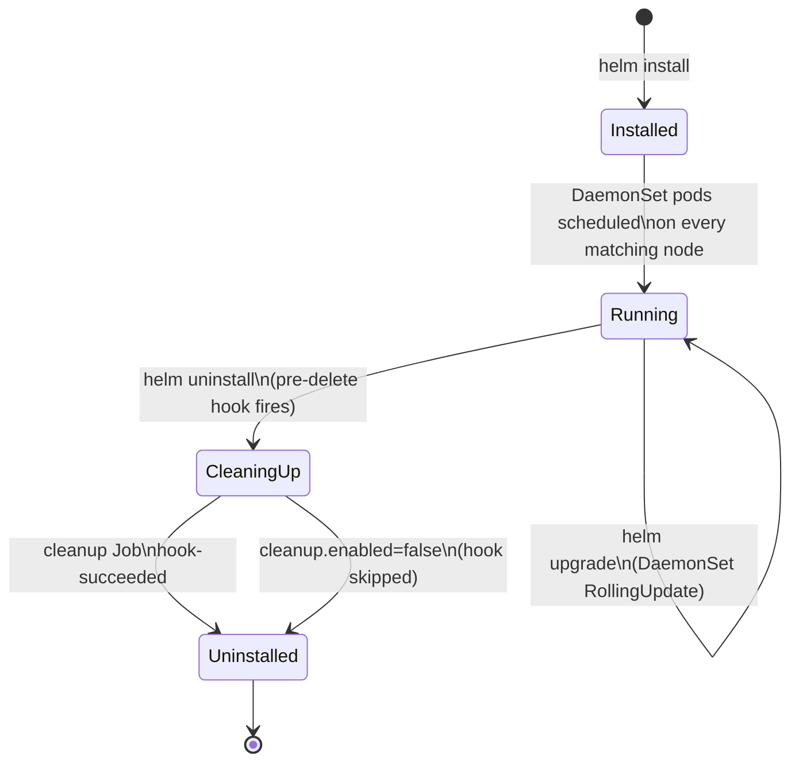
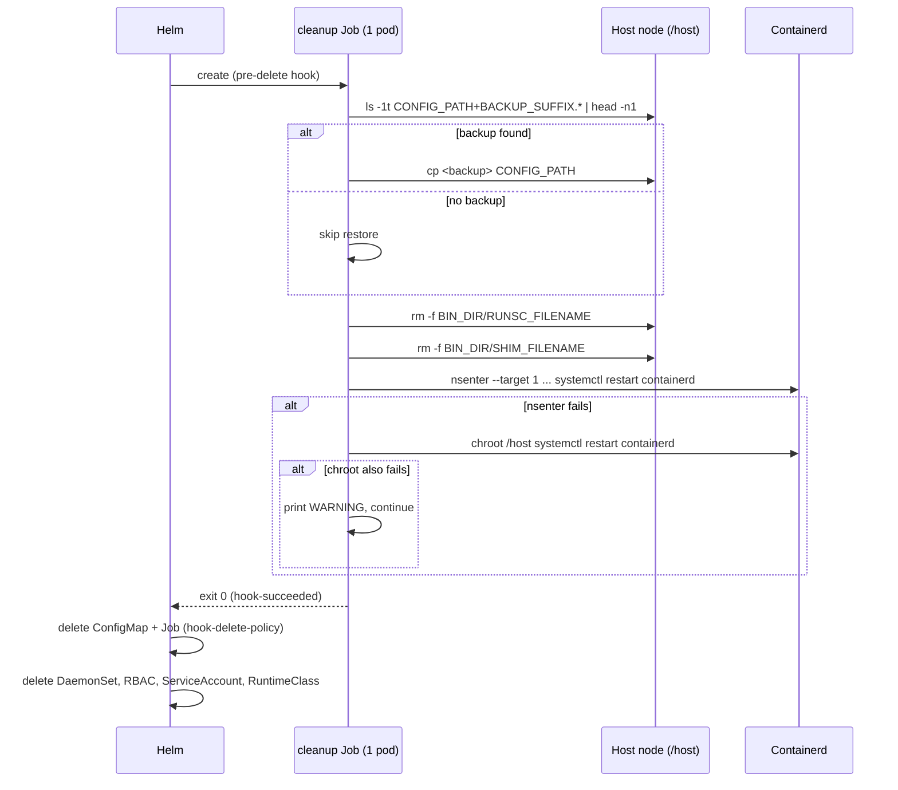

# Helm Release Lifecycle

This page walks through the full lifecycle of the `gvisor-deploy` release — install, upgrade,
and uninstall — with emphasis on the `pre-delete` cleanup hook that undoes the DaemonSet's
host-level changes. It assumes you've read the resource inventory in
[Architecture](architecture.md) and the install flow in [Install flow](install-flow.md).

**What you'll find here**
- The state machine for a release across `helm install` / `upgrade` / `uninstall`
- How DaemonSet upgrades roll out via `RollingUpdate`
- The `pre-delete` hook mechanics: `-cleanup` ConfigMap + cleanup Job, hook annotations
- A line-by-line walkthrough of `cleanup.sh`
- The single-node cleanup limitation, and how to work around it

## Lifecycle overview



- **Installed → Running**: `helm install` renders the DaemonSet, RBAC, ServiceAccount,
  ConfigMaps, and (if `runtimeClass.create`) the RuntimeClass. The DaemonSet's `installer`
  container runs `install.sh` on every node matched by `nodeSelector`/`tolerations`/`affinity`,
  then `exec sleep infinity` to stay `Running`/`Ready`. See [Install flow](install-flow.md) for
  the script's exact steps.
- **Running → Running (upgrade)**: `helm upgrade` re-renders templates and updates the DaemonSet
  spec. Kubernetes applies `.Values.updateStrategy` (default `RollingUpdate`) to roll installer
  pods node-by-node; each replaced pod re-runs `install.sh`, which is idempotent (skips the
  containerd config edit if the `runtimes.<RUNTIME_NAME>]` block already exists, re-installs
  binaries unconditionally).
- **Running → CleaningUp → Uninstalled**: `helm uninstall` triggers the `pre-delete` hook (if
  `cleanup.enabled`, default `true`) before deleting the DaemonSet, RBAC, and other release
  resources. The hook runs a one-shot Job, then Helm deletes the release's remaining objects.

## The pre-delete cleanup hook

Two templates carry the hook annotations and only render when `cleanup.enabled` is `true`:

| Template | Kind | Name | Role |
|---|---|---|---|
| `configmap-cleanup.yaml` | ConfigMap | `<fullname>-cleanup` | Holds `cleanup.sh`, mounted at `/scripts` (mode `0755`) |
| `cleanup-job.yaml` | Job (`batch/v1`) | `<fullname>-cleanup` | Runs `cleanup.sh` in a privileged, `hostPID: true` pod |

Both carry the same Helm hook annotations:

```yaml
annotations:
  "helm.sh/hook": pre-delete
  "helm.sh/hook-delete-policy": before-hook-creation,hook-succeeded
```

- `helm.sh/hook: pre-delete` — Helm creates and waits on these resources *before* it deletes
  the rest of the release (DaemonSet, RBAC, ServiceAccount, RuntimeClass). The Job must reach
  `hook-succeeded` or `helm uninstall` fails/waits, depending on `--timeout`.
- `helm.sh/hook-delete-policy: before-hook-creation,hook-succeeded` — a leftover ConfigMap/Job
  from a prior failed uninstall is deleted right before this hook fires again
  (`before-hook-creation`), and the new ones are deleted once the Job succeeds
  (`hook-succeeded`). A failed cleanup Job is left in place for inspection.

The cleanup Job mirrors the DaemonSet's host-access model: `restartPolicy: OnFailure`,
`hostPID: true`, `securityContext.privileged: true`, host `/` mounted at `/host`, and the
`-cleanup` ConfigMap mounted at `/scripts`. It honors the same `nodeSelector`/`tolerations`/
`affinity` values as the installer. Env vars passed in: `BIN_DIR`, `CONFIG_PATH`,
`BACKUP_SUFFIX`, `RUNTIME_NAME`, `RUNSC_FILENAME`, `SHIM_FILENAME` — all sourced from
`.Values` the same way the DaemonSet's are (see [Install flow](install-flow.md) for the full
env table).

### cleanup.sh logic

`cleanup.sh` (`configmap-cleanup.yaml`) runs with `set -eu` inside the cleanup Job:

1. **Restore containerd config from backup.** List `/host${CONFIG_PATH}${BACKUP_SUFFIX}.*`
   sorted newest-first (`ls -1t ... | head -n1`). If a backup exists, `cp` it back over
   `/host${CONFIG_PATH}`, undoing the `runtimes.<RUNTIME_NAME>]` block that `install.sh`
   appended. If no backup is found (e.g. the file didn't exist before install, or
   `restartContainerd`/install never ran on this node), the restore step is skipped.
2. **Remove the gVisor binaries.** `rm -f` on `/host${BIN_DIR}/${RUNSC_FILENAME}` and
   `/host${BIN_DIR}/${SHIM_FILENAME}`, each guarded by an `-f` existence check first.
3. **Restart containerd, best-effort.** Try `nsenter --target 1 --mount --uts --ipc --net
   --pid -- systemctl restart containerd`; on failure fall back to `chroot /host systemctl
   restart containerd`; on failure print a `WARNING` and continue. Both attempts are joined
   with `||`, so a restart failure does not fail the Job or block hook-succeeded.



## Limitation: cleanup runs on exactly one node

This is the most important operational caveat in this chart: **the cleanup Job is a single-pod
`batch/v1` Job, not a DaemonSet.** The scheduler places it on exactly one node that satisfies
`nodeSelector`/`tolerations`/`affinity` — the same selection criteria the DaemonSet used, but
without the DaemonSet's guarantee of one pod per matching node.

The asymmetry:

- **Install** ran the installer DaemonSet on **every** matching node — binaries copied,
  containerd config patched, containerd restarted, on each one independently.
- **Uninstall**'s cleanup Job restores the backup, removes binaries, and restarts containerd on
  **only the one node it lands on**.

Consequence: after `helm uninstall`, every other node that previously ran the installer still
has the `runsc`/`containerd-shim-runsc-v1` binaries installed, the containerd config still
patched with the `runtimes.<RUNTIME_NAME>]` block, and a stray timestamped backup file under
`${CONFIG_PATH}${BACKUP_SUFFIX}.<timestamp>`. The chart does not reconcile this automatically —
there's no per-node cleanup guarantee analogous to the DaemonSet's install guarantee.

If you need every node fully reverted, run the equivalent of `cleanup.sh` by hand (or via your
own DaemonSet/Job) against each node before or after `helm uninstall`, using the same
`BIN_DIR`, `CONFIG_PATH`, `BACKUP_SUFFIX`, `RUNTIME_NAME`, and filename values you installed
with — see [Reference values](usage-and-security.md) for the value keys. See
[Usage & security](usage-and-security.md) for the broader host-mutation security model this
limitation sits inside of.

## See also

- [Architecture](architecture.md) — full resource inventory and how they relate
- [Install flow](install-flow.md) — `install.sh` step-by-step, env var table
- [Usage & security](usage-and-security.md) — RuntimeClass usage, privileged/hostPID model, mitigations
- [docs home](README.md)
