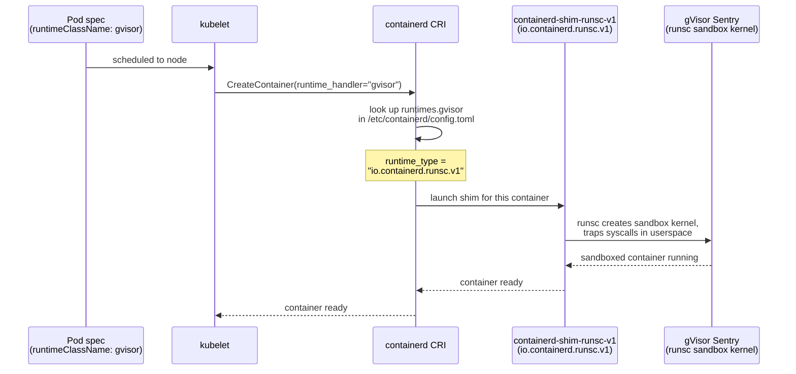
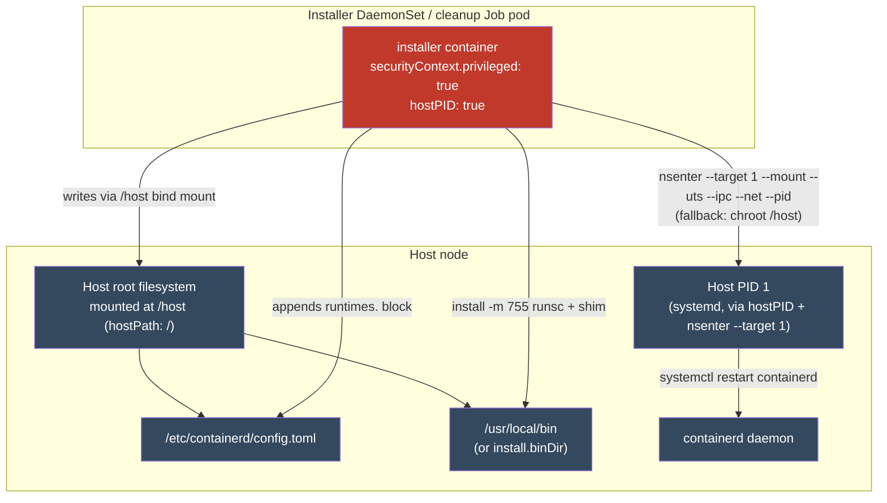

# Usage & Security

How a workload opts into the gVisor sandbox via `RuntimeClass`, what happens on
the request path when it does, and the security model of the privileged
installer that makes it possible — including the blast radius you accept and
the mitigations the chart provides.

## What you'll find here

- [Part 1: Usage](#part-1-usage) — opting in with `spec.runtimeClassName`, the
  runtime request path, an example Pod, and how to verify a pod is actually
  sandboxed.
- [Part 2: Security model](#part-2-security-model) — the blast radius of the
  privileged DaemonSet/Job, and a risks-vs-mitigations table.

---

## Part 1: Usage

### Opting in: `spec.runtimeClassName`

The chart renders a cluster-scoped `RuntimeClass` (`templates/runtimeclass.yaml`,
only if `runtimeClass.create` is `true`):

```yaml
apiVersion: node.k8s.io/v1
kind: RuntimeClass
metadata:
  name: {{ .Values.runtimeClass.name }}   # default: gvisor
handler: {{ .Values.containerd.runtimeName }}   # default: runsc
```

Nothing about gVisor is mandatory cluster-wide — it's opt-in **per pod**. A
workload only runs inside the gVisor sandbox if its spec names the
`RuntimeClass`:

```yaml
spec:
  runtimeClassName: gvisor
```

Omit the field (or use a different `RuntimeClass`) and the pod runs on the
node's default runtime (typically `runc`) as normal. This means you can adopt
gVisor incrementally, workload by workload.

### The runtime request path

Once a pod with `runtimeClassName: gvisor` is scheduled to a node, here's what
resolves the handler into an actual sandboxed container:



The handler name (`gvisor`) is just a label on the `RuntimeClass`; the actual
binding to `runsc` happens through `containerd.runtimeName` (default `runsc`),
which the installer DaemonSet writes into the node's `config.toml` under:

```toml
[plugins."io.containerd.grpc.v1.cri".containerd.runtimes.runsc]
  runtime_type = "io.containerd.runsc.v1"
```

See [Install flow](install-flow.md) for exactly how and when that config entry
gets written, and [Architecture](architecture.md) for how the `RuntimeClass`
relates to the rest of the chart's resources.

### Example Pod manifest

```yaml
apiVersion: v1
kind: Pod
metadata:
  name: nginx-gvisor
spec:
  runtimeClassName: gvisor
  containers:
    - name: nginx
      image: nginx
```

Apply it like any other pod:

```sh
kubectl apply -f nginx-gvisor.yaml
```

If the `RuntimeClass` doesn't exist yet, or no node has the `runsc` handler
registered, the pod will fail to start with a `RuntimeClass` or CRI-level
error — confirm `runtimeClass.create=true` was set at install time and that
the installer DaemonSet completed successfully on the target node.

### Verifying a pod is actually sandboxed

gVisor's Sentry emits its own kernel-style boot log into the sandboxed
container's `dmesg` ring buffer. The presence of gVisor-specific lines is the
simplest in-pod proof that you're running under `runsc` and not the host's
native runtime:

```sh
kubectl exec nginx-gvisor -- dmesg | grep -i gvisor
```

A pod running under the normal `runc` runtime won't produce any matching
output (it sees the real host kernel's `dmesg`, which has no gVisor banner).

---

## Part 2: Security model

The installer DaemonSet (and the `pre-delete` cleanup Job — see
[Lifecycle](lifecycle.md)) both run with `privileged: true`, `hostPID: true`,
and a `hostPath` mount of the node's root filesystem (`/`) at `/host`. That
combination is what lets `install.sh` write binaries and edit containerd's
config directly on the host, and it is also the chart's full blast radius:
anything that combination of permissions can reach, a compromised installer
image or a malicious patch to the DaemonSet spec can reach too.

### Blast radius



In practical terms, the installer container (or anyone who can edit its
spec/image) can:

- **Write arbitrary host binaries** — anything placed at
  `/host${BIN_DIR}` lands directly on the node's filesystem, executable.
- **Rewrite containerd's config** — `/host${CONFIG_PATH}` is appended to
  (or could be replaced) with arbitrary runtime definitions.
- **Restart, or otherwise act as, the host's containerd** — `nsenter --target
  1 --mount --uts --ipc --net --pid` enters PID 1's namespaces (i.e. the
  host's own namespaces), with `chroot /host` as a fallback. This is
  effectively unrestricted host access, not just a containerd restart.

This is the same trust model as `kata-deploy` and similar node-installer
DaemonSets: the privilege is inherent to the job (installing a container
runtime onto a node *is* a host-level operation), not a chart bug. Treat the
installer image and the chart's RBAC/values as part of your cluster's trusted
admin surface.

### Risks vs. in-chart mitigations

| Risk | In-chart mitigation |
|---|---|
| Pulling binaries from a compromised or spoofed public source | `binaries.baseUrl` defaults to a non-functional placeholder (`https://repo.example.com/repository/gvisor-raw`) and must be set explicitly to **your** private repo (e.g. an internal raw repository) — the chart never reaches the public gVisor storage unless you point it there. |
| Tampered or corrupted `runsc` / shim binaries in transit | Optional `binaries.verifyChecksum` (default `false`); when enabled, each binary's `.sha512` is downloaded alongside it and checked with `sha512sum -c` before install. |
| Disabling TLS verification (`--insecure`) to reach a repo behind a private CA | `caBundle.enabled` mounts your CA cert (read-only Secret) and passes it to curl (`--cacert`) / wget (`--ca-certificate`), so TLS verifies against the private CA without `--insecure`. The installer exits 1 if the CA file is set but missing/unreadable — no silent fallback to insecure. |
| Leaking repo credentials via Helm values | Credentials are sourced from a Kubernetes `Secret` (`downloadSecret.enabled`, `usernameKey`/`passwordKey`) and injected as env vars (`REPO_USERNAME`/`REPO_PASSWORD`), never written into plain `values.yaml`. |
| Irrecoverable edits to `/etc/containerd/config.toml` | Every install takes a **timestamped backup** (`${CONFIG_PATH}${BACKUP_SUFFIX}.$(date +%s)`) before editing, and the config edit itself is idempotent (skipped if the runtime block already exists). On `helm uninstall`, the cleanup Job restores the newest backup. |
| Repeated/duplicate config edits on DaemonSet restarts | `install.sh` checks for `runtimes.<RUNTIME_NAME>]` in the existing config before appending — safe to re-run. |
| Node CRI disruption | `RESTART_CONTAINERD` (default `true`) restarts containerd to load the new runtime — this is a **brief** disruption to the node's container runtime, not the node itself; in-flight container operations on that node may be momentarily affected. Set `containerd.restartContainerd=false` to defer the restart if you need to control the timing. |
| Cleanup Job not reaching every node | The cleanup Job is a single-pod `batch/v1` Job, not a DaemonSet — it only cleans up the one node it happens to land on. See [Lifecycle](lifecycle.md) for the full implication. |

For the resources and RBAC behind all of this, see
[Architecture](architecture.md); for the exact script logic referenced above,
see [Install flow](install-flow.md).

---

[docs home](README.md) · [Architecture](architecture.md) ·
[Install flow](install-flow.md) · [Lifecycle](lifecycle.md)
